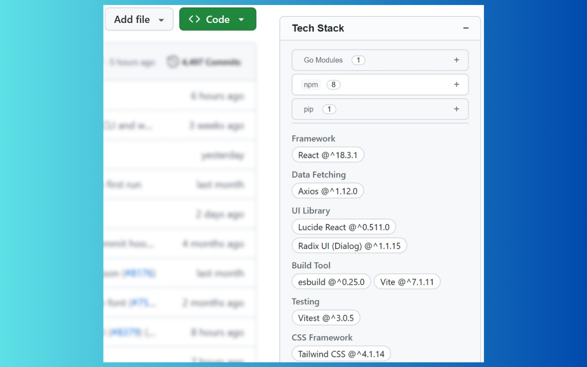

# 栈查查 (zhanStack) - 显示GitHub仓库所使用的技术栈

浏览器扩展，能够分析并展示 GitHub 仓库所使用的技术栈。



## 🌟 主要功能

- **🚀 分析技术栈**：自动搜索项目中所有包管理文件，并分析其中的技术栈。
- **🏷️ 智能分类**：将依赖项自动归类为 **框架**、**构建工具**、**测试库**、**状态管理**等。
- **📦 广泛的工具链支持**：以**包管理器/构建工具**为核心维度，支持主流开发生态：
  - **npm**: `package.json`
  - **pip / Poetry / uv / Conda / Pipenv**: `requirements.txt`, `pyproject.toml`, `poetry.lock`, `uv.lock`, `environment.yml`, `Pipfile`
  - **Go Modules**: `go.mod`
  - **Cargo (Rust)**: `Cargo.toml`
  - **Maven / Gradle (Java)**: `pom.xml`, `build.gradle`
  - **NuGet / .NET SDK**: `packages.config`, `*.csproj`, `*.sln`, `Directory.Packages.props`
  - **Swift PM / CocoaPods / Carthage**: `Package.swift`, `Podfile`, `Cartfile`, `project.pbxproj`
  - **CMake / Bazel / Xmake / MSBuild**: `CMakeLists.txt`, `MODULE.bazel`, `WORKSPACE`, `xmake.lua`, `*.vcxproj`

## 📦 安装

Chrome Web Store: https://chromewebstore.google.com/detail/kebfbpfgnkegkhmfkkbhgidkjghbleco

### 手动安装

前往 [Releases](https://gitee.com/CrankZ/zhan-stack/releases) 页面，下载最新版本的安装包：
- **`.crx` 文件**：适用于 Chrome 浏览器的标准安装包。
- **`.zip` 压缩包**：适用于手动加载的源码包。

## 🛠️ 技术栈

- **框架**: [WXT](https://wxt.dev/)
- **前端库**: [React 19](https://react.dev/)
- **语言**: [TypeScript](https://www.typescriptlang.org/)
- **构建工具**: [Vite](https://vitejs.dev/)
- **代码规范**: [Biome](https://biomejs.dev/)

## 🚀 自行编译

安装依赖
```bash
pnpm install
```

构建

```bash
pnpm run build
```

构建产物将存放在 `.output` 目录下。

